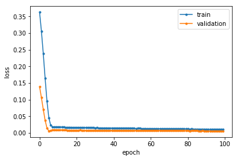
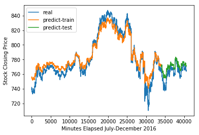
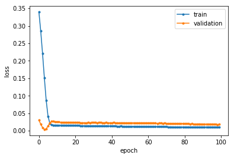
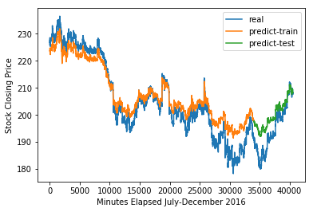
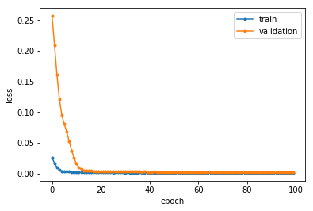
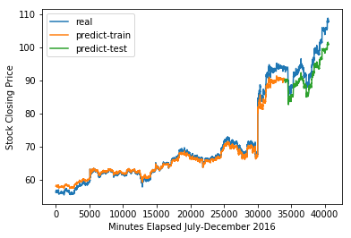

# ECE629-Neural-Networks
## Overview
The goal of this project is to perform time series prediction on financial data using machine learning. The dataset used are based on NASDAQ stock closing prices. Using LSTM architecture, a neural network is trained on the dataset to predict stock prices.
## Data Description
The NASDAQ 100 stock dataset is obtained from Qin et. al [1], which stands for 100 major corporations listed on the NASDAQ stock market. The actual dataset consists of only 81 corporations due to large amount of missing data for some corporations. Specifically, this project used the small dataset, which only includes 105 days stock data from July 26, 2016, to December 22, 2016. Each day contains 390 data points except for 210 data points on November 25 and 180 data points on December 22. The frequency of data collection is by one minute. For the project, we chose the stock prices of the following corporations for training: Google, Amazon, Nvidia, and Tesla.

## Neural Network
As mentioned before, we will be using LSTM (Long Short Term Memory) network to train and test the stock prices. Since time series prediction is a type of sequence problem, recurrent neural networks (RNNs) tend to perform better than others due to its neuron connections in a directed graph structure. Each neuron can retain state from previous iteration by using their own output as input for next neuron. Simple RNNs often work better on problems involving short term memory; however, they do not perform as well for problems with longer time dependency. 

LSTM compensates for the long term memory our problem, as stock predictions require looking over long sequences of prices. LSTM can achieve this through its memory block structure that replaces traditional neurons. Each block unit contains a forget gate, input gate, and output gate, which contains activations to manage the block’s state and output. The gate structure also suppresses the vanishing gradient issue through an identity function followed by sigmoid activation in forget gate that ensures the output to be 1 or 0. This kind of network structure allows more sophisticated learning and memory from a layer during training.

## Network Architecture

  

The model consists of two LSTM layers each with 40 memory blocks and a single neuron dense layer before the output to make a single prediction on a stock closing price. We input the data points in a mini batch of 32 each epoch. At the first LSTM layer, we apply regular and recurrent dropout regularization at a rate 0.2 to reduce overfitting. Here, recurrent dropout refers to dropping connections between recurrent memory blocks. A second LSTM layer was used to make the network deeper in hopes of learning more complex features in the dataset. The final dense layer uses linear activation, because for a regression problem like time series prediction, predictions values can be unbounded rather than a specific class label.

## Performance Metric and Loss
The loss function chosen for evaluating training performance is mean squared error. The optimizer chosen is Adam, which stands for adaptive motion estimation. It performs using the advantages of adaptive gradient algorithm (AdaGrad) and root mean square propagation (RMSProp). Adam computes the exponential moving average based on the average in first moment and controls the decay rates of the average with decay rates beta1 and beta2 [3]. 

## Results
### Google Stocks

  
     

### Amazon Stocks

  
     

### Tesla Stocks

  
     

### Nvidia Stocks

  
     

## Reference 
Reference
[1] A Dual-Stage Attention-Based Recurrent Neural Network for Time Series Prediction. Qin, Y., Song, D., Cheng, H., Cheng, W., Jiang, G., Cottrell, G.
International Joint Conference on Artificial Intelligence (IJCAI ) , 2017. 

[2] Time Series Prediction with LSTM Recurrent Neural Networks in Python with Keras. Machine Learning Mastery. August 30, 2018. https://machinelearningmastery.com/time-series-prediction-lstm-recurrent-neural-networks-python-keras/. Accessed 9 December, 2018

[3] Gentle Introduction to the Adam Optimization Algorithm for Deep Learning. Machine Learning Mastery. November 25, 2018. https://machinelearningmastery.com/adam-optimization-algorithm-for-deep-learning/. Accessed 9 December, 2018

